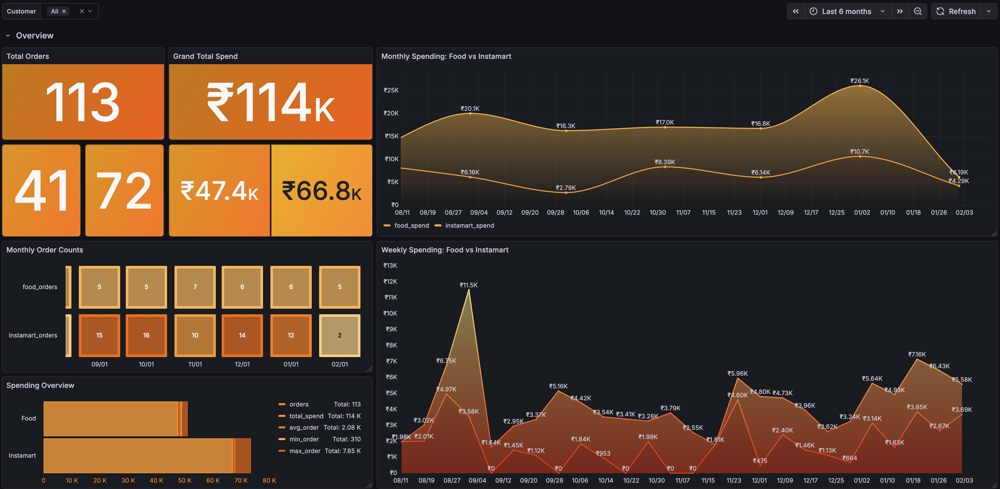

# Swiggy Unified Billing Insights

Parse Swiggy **Food** and **Instamart** invoices, build a unified analytics model in PostgreSQL, and visualize spend and behavioral patterns via Grafana dashboards.



---

## At a glance

| Dimension        | What this project delivers                    |
| ---------------- | --------------------------------------------- |
| Data source      | Swiggy Food + Instamart account statements    |
| Processing model | Automated PDF extraction + structured loading |
| Storage          | PostgreSQL unified schema                     |
| Consumption      | Grafana dashboard suite (30+ panels)          |
| Strategic value  | Cross-BL spend and behavior intelligence      |

---

## Why this project is strategically strong

This repository goes beyond personal finance tracking and demonstrates business-grade analytics capability aligned with **Competitive Intelligence & Growth Analytics** responsibilities:

- **Cross-BL comparison:** Food BL vs Instamart BL in one schema
- **Behavioral intelligence:** order frequency, spend concentration, repeat patterns, outlier spending
- **Commercial diagnostics:** discount effectiveness, fee leakage, tax burden visibility
- **GTM support:** customer-cohort and value segmentation ready for retention/upsell experiments

---

## What it does

- Parses Swiggy account-statement summary PDFs (Food + Instamart)
- Follows embedded “View” invoice links to fetch detailed bills
- Extracts line-level fields: item, quantity, taxes, discounts, handling fees
- Loads data into PostgreSQL with idempotent upserts
- Serves a Grafana dashboard with 30+ analysis panels
- Supports multiple users in the same pipeline

---

## End-to-end workflow

1. Export account statements from the Swiggy app
2. Drop summary PDFs into `input/food/` and `input/instamart/`
3. Run Docker Compose stack
4. Parser downloads and processes all detailed invoices
5. Data is upserted into normalized tables
6. Grafana dashboards become available at runtime

---

## Getting account statements from Swiggy

1. Open **Swiggy app** → **Profile**
2. Go to **Account Statements**
3. Select date duration (up to 6 months/request)
4. Select category (**Food** or **Instamart**)
5. Tap **Get Report** and wait for email delivery

Request both categories for complete cross-BL coverage.

---

## Quick start

### 1) Setup

```bash
git clone https://github.com/dannotes/swiggyit.git
cd swiggyit
cp .env.example .env
```

Update credentials in `.env`.

### 2) Place PDFs

```text
input/
├── food/
│   └── order_summary_food_<uuid>.pdf
└── instamart/
    └── order_summary_instamart_<uuid>.pdf
```

### 3) Run

```bash
docker compose up -d
```

Open Grafana at `http://localhost:3000`.

---

## Dashboard modules

### Overview

Total spend, order count, BL split, monthly and weekly trends.

### Food analytics

Top restaurants, spend concentration, item-level patterns, tax trends.

### Instamart analytics

Top sellers, basket behavior, handling fee patterns, discount savings.

### Spending patterns

Day-of-week behavior, order-value distribution, cumulative spend, repeat purchases.

---

## Cross-BL KPI ideas (Food vs Instamart)

- Average order value by BL
- Discount-to-gross ratio by BL
- Fees/taxes as % of net paid
- Repeat-purchase concentration by BL
- Month-over-month spend volatility by BL

These KPIs are practical building blocks for growth experiments and monetization diagnostics.

---

## Repo structure

```text
Swiggy-Unified-Billing-Insights/
├── src/                 # parsers, downloader, loader, validators
├── sql/                 # schema and analysis SQL
├── grafana/             # dashboard + datasource provisioning
├── docs/                # architecture notes
├── tests/               # unit and integration tests
├── docker-compose.yml
└── README.md
```

---

## Tech stack

- Python 3.12+
- PostgreSQL 17
- Grafana
- Docker Compose
- PyMuPDF, pdfplumber, psycopg, httpx, pytest

---

## Business impact metrics you can report

- **Cross-BL spend split** (Food vs Instamart)
- **Discount efficiency** (discount-to-gross ratio)
- **Fee burden trend** (fees/taxes as % of paid amount)
- **Repeat behavior** (order recurrence and concentration)
- **Volatility** (month-over-month spend movement)

These metrics help prioritize retention, pricing, and monetization experiments.

---

## Why hiring teams care

This project demonstrates the ability to:

- Build robust ingestion pipelines from unstructured financial PDFs
- Standardize multi-line-of-business data into a single analytical model
- Translate transactional data into business and growth insights
- Deliver production-style observability dashboards for decision makers

---

## License

[MIT](LICENSE)
